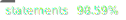
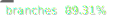
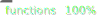
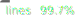

# Budget-App-JavaScript

[](https://github.com/61Ss/CPT304-CW1-Budget-App-Group59/actions/workflows/test.yml)
[](https://codecov.io/gh/61Ss/CPT304-CW1-Budget-App-Group59)

<!-- Local Istanbul-generated SVG badges (regenerated by `npm run badges`). -->





Welcome to the Budget App! This project is the result of following a comprehensive YouTube tutorial that guides you through building a budget management application from scratch. With this app, you can efficiently track your income, expenses, and overall budget, gaining better control of your financial situation.

## Demo
You can check out the live demo of the Budget App here.
**Online Demo of Project :**

<a href="https://smircodes.github.io/Budget-app/" title="Budget-App">Link to Budget App</a>

## Features

- Income and Expense Tracking: The Budget App allows you to enter your sources of income and expenses, categorizing them for better organization.

- Budget Calculation: Based on the provided income and expenses, the app calculates your budget by subtracting expenses from income, giving you a clear overview of your financial status.

- Monthly Reports: Get a comprehensive monthly report that summarizes your income, expenses, and the resulting budget. This helps you understand your spending patterns over time.

- Simple and Intuitive Interface: The app boasts a user-friendly interface, making it easy for anyone to navigate and use, even if you have little to no prior experience with budgeting applications.

- Internationalization (i18n): The app ships with English and Simplified Chinese (中文). A language switcher in the top-right of every page lets users toggle on the fly. The choice is persisted in `localStorage`, falls back to the browser's preferred language on first visit, and updates static labels, ARIA attributes, validation messages, the cookie banner, and the privacy policy in one shot.

## Usage
1. Clone the repository or download the ZIP file.

1. Open the project in your preferred code editor.

1. Launch the index.html file in your browser to run the Budget App locally.

1. Start by adding your income and expenses to track your budget. The app will automatically calculate your available budget.

1. Monitor your budget regularly and adjust your spending to achieve your financial goals.

## Technologies Used
The Budget App was built using the following technologies and tools:

- HTML5
- CSS3
- JavaScript
- Custom lightweight i18n runtime (`i18n.js`) — no framework, driven by `data-i18n*` attributes on the markup

### Adding or editing translations
1. Open `i18n.js`.
2. Each language has its own dictionary inside the `translations` object (`en` and `zh`).
3. Add or edit the desired key/value pair in **both** dictionaries to keep them in sync.
4. In the markup, reference the key with `data-i18n="your.key"` for text content, `data-i18n-attr="placeholder:your.key,aria-label:another.key"` for attributes, or `data-i18n-title="your.key"` on the `<html>` element for the document title.
5. To add a third language, register a new dictionary, add a `<button class="lang-option" data-lang="…">` to the language switcher in `index.html` and `privacy.html`, and the runtime picks it up automatically.

## Testing & Coverage

The project ships with a Jest + jsdom test suite (65 tests across `budget.js`, `chart.js`, and `i18n.js`) and is wired up to two coverage proofs.

### Run the tests locally

```bash
npm install
npm test                 # run the full Jest suite
npm run test:coverage    # run + emit coverage/ (text, html, lcov, json-summary)
npm run badges           # regenerate the Istanbul SVG badges in badges/
```

The Jest config in `package.json` enforces a hard `coverageThreshold` of **80 %** for statements / branches / functions / lines. Falling below that threshold fails the test run (and the CI build).

### Coverage proofs

1. **Codecov badge** (live, refreshed every push). The GitHub Actions workflow at `.github/workflows/test.yml` runs `npm run test:coverage` on every push / PR and uploads `coverage/lcov.info` to [Codecov](https://codecov.io). The badge at the top of this README links to the latest report. `codecov.yml` enforces the same 80 % gate at the project and patch level.
2. **Istanbul SVG badges** (offline, version-controlled). `npm run badges` reads `coverage/coverage-summary.json` (produced by Jest's `json-summary` reporter) and writes one SVG per metric into `badges/`. These are committed so the README renders correct badges even without network access during marking.

## Credits
The Budget App tutorial was created by [aaramiss](https://samiraatech.github.io/Budget-app/).

## License
The Budget App is released under the MIT License. You are free to use, modify, and distribute this project for personal and commercial purposes.

## Feedback and Support
If you have any questions, suggestions, or issues with the Budget App, feel free to reach out by creating an issue in the [GitHub repository]([url](https://github.com/aaramiss/Budget-app/issues)). We welcome any feedback to improve the app and make it even more useful for managing personal finances.

Happy budgeting!
